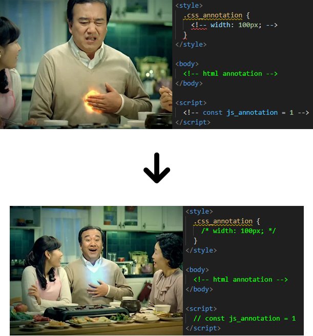

# Easy Annotation

Easy Annotation은 HTML 파일 내에서 현재 커서 위치의 컨텍스트(HTML, `` `<script>` `` 태그 내 JavaScript, `` `<style>` `` 태그 내 CSS)를 지능적으로 감지하여, `Ctrl+/` (macOS: `Cmd+/`) 단축키를 눌렀을 때 각 언어에 맞는 올바른 스타일의 주석을 자동으로 토글해주는 VS Code 확장입니다.

## Features

- HTML 파일 내의 HTML, JavaScript, CSS 컨텍스트 자동 감지
- JavaScript 영역에서는 `` `//` `` 스타일 주석 토글
- CSS 영역에서는 `` `/* ... */` `` 스타일 주석 토글 (각 라인 적용)
- 그 외 HTML 영역에서는 ` ` `` 스타일 주석 토글 (VS Code 기본 동작 활용)
- 표준 `Ctrl+/` (macOS: `Cmd+/`) 주석 토글 단축키 사용
- TextMate 문법을 활용한 정확한 언어 범위 분석

## 사용 방법

1. HTML 파일을 엽니다.
2. 주석을 추가하거나 제거하고 싶은 코드 라인에 커서를 두거나 영역을 선택합니다.
3. `Ctrl+/` (macOS: `Cmd+/`) 단축키를 누릅니다.
